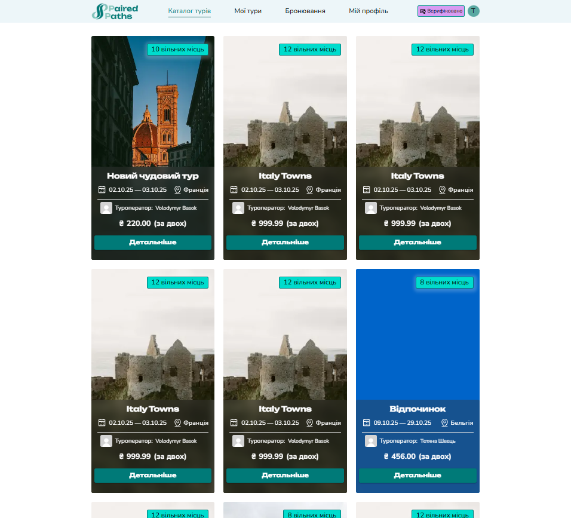
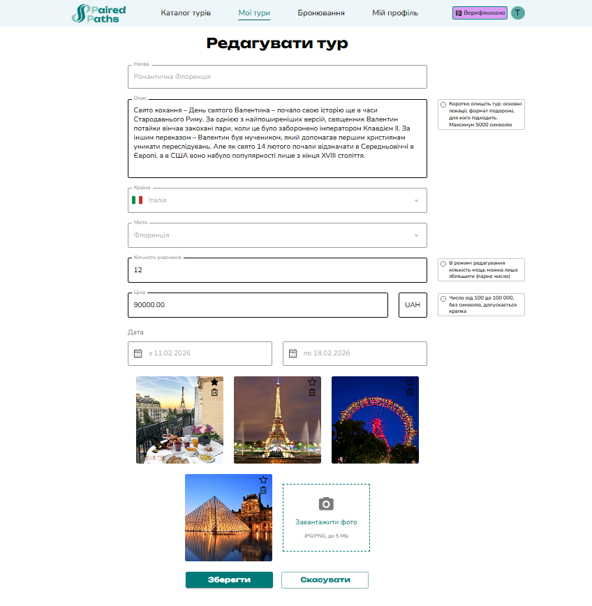

# Booking CRM

Booking CRM is a **production-ready MVP frontend application** for an online booking and tour management system.

The project demonstrates a real-world role-based product with authentication, payments, business logic, and a scalable frontend architecture. It was built as a team project and reflects practical engineering decisions rather than a demo-only app.

---

## 🔗 Links

- **Live demo:** [https://booking-crm-dev.netlify.app/](https://booking-crm-dev.netlify.app/)
- **Frontend repository:** [https://github.com/BookingCRMteam/booking-crm-front](https://github.com/BookingCRMteam/booking-crm-front)
- **Backend repository:** [https://github.com/BookingCRMteam/booking-crm-back](https://github.com/BookingCRMteam/booking-crm-back)
- **Admin panel:** [https://booking-crm-admin.netlify.app/](https://booking-crm-admin.netlify.app/) (operator approval flow)

---

## 🚀 Product Overview

Booking CRM allows users to browse tours, book them online, and manage bookings, while operators can create and manage their own tours after approval.

The system supports **different user roles**, real payment flows, and complex booking states.

---

## 👥 Roles & Access Model

### Guest / User

- Browse tour catalog
- View tour details
- Veiw information about operator
- Book tours
- Access personal dashboard
- See booked tours with payment status:
  - paid
  - awaiting payment

- Retry payment if the previous attempt expired

### Operator

- Starts as a regular user
- Can **apply to become an operator**
- Gets access after **admin approval**
- Has a dedicated operator dashboard

### Operator Capabilities

- Create tours
- Edit tours
- Delete tours _(only if there are no bookings)_
- View booked tours and booking details

---

## 🧭 Key Features (Implemented MVP)

- Auth0 authentication
- Role-based access control (user / operator / admin)
- Operator approval flow via admin panel
- Public tour catalog
- Tour details page
- Public operator page
- Conditional UI behavior based on role
- Booking flow with multiple states
- **Payment integration via LiqPay**
  - payment timeout (60 minutes)
  - retry payment

- User dashboard (bookings & statuses)
- Operator dashboard (tour & booking management)

---

## 🧱 Architecture

The project uses **Next.js App Router** with a modular architecture inspired by **Feature-Sliced Design (FSD)**.

### `src/` structure

- **app/** — routing, layouts, pages
- **components/** — shared UI components
- **features/** — feature-level logic (auth, booking, payment)
- **entities/** — domain entities (Tour, Booking, User)
- **shared/** — API clients, hooks, constants, UI primitives

This structure allows the project to scale without large refactors.

---

## 🛠 Tech Stack

- **Next.js (App Router)**
- **React 19**
- **TypeScript**
- **MUI**
- **React Hook Form + Zod**
- **TanStack Query**
- **Zustand**
- **Auth0**
- **Axios**

---

## 🧪 Testing Strategy

The project follows a balanced testing strategy with a focus on both business logic and UI reliability:

Unit tests cover core logic:

- form validation schemas (Zod)

- business rules and helpers

- custom hooks and API-related logic

- utility functions

Component tests are used where they bring real value.

Highly complex UI interactions (e.g. large forms with multiple dependencies, date pickers, file uploads):

- are tested indirectly via schema and hook tests

- are considered better candidates for e2e testing

---

## 📚 Storybook

Storybook is used for isolated UI development and component validation.

```bash
npm run storybook
```

It helps:

- develop reusable components
- test visual states (loading, error, disabled)
- collaborate within a team

---

## ▶️ Getting Started

### Requirements

- Node.js **18+** (LTS recommended)
- npm **9+**

### Installation

```bash
git clone https://github.com/BookingCRMteam/booking-crm-front.git
cd booking-crm-front
npm install
```

### Run locally

```bash
npm run dev
```

---

## 📜 Scripts

| Script    | Description              |
| --------- | ------------------------ |
| dev       | Start development server |
| build     | Production build         |
| start     | Run production build     |
| lint      | ESLint                   |
| format    | Prettier                 |
| test      | Run Jest tests           |
| coverage  | Test coverage report     |
| storybook | Run Storybook            |

---

## 🔒 Code Quality

- ESLint + Prettier
- Husky + lint-staged
- Conventional Commits

---

## 💡 Project Notes

- This project represents an MVP stage
- Focused on real business logic rather than visual polish
- Designed to be extended with analytics, calendar sync, and payments expansion

---

## 🖼 Screenshots

### Tour Catalog

  
_Example view of the public tour catalog page._

---

## 🎥 Demo Video

### Operator Tour Creation

Click the image below to watch a 2-minute walkthrough of creating a tour as an operator:

[](./media/operator-demo.mp4)

_Video demonstrates the operator dashboard, creating a tour, and managing bookings._

**Made with ❤️ by the Booking CRM Frontend team**
